# 📘 Documentación Completa del Sistema de Gestión de Proyectos

> **Para quién es este documento:** para todo el equipo, incluso si nunca tocaste NestJS, Angular ni una base de datos.
> Vamos a ir **desde el backend hasta el frontend**, explicando *qué hace cada cosa*, *por qué existe* y *cómo se conecta con lo demás*, en un lenguaje lo más simple posible.
>
> Leelo de arriba hacia abajo la primera vez. Después lo vas a usar como referencia para buscar cosas puntuales.

---

## 📑 Índice

1. [¿Qué es este proyecto? (en palabras simples)](#1-qué-es-este-proyecto-en-palabras-simples)
2. [Conceptos básicos que necesitás entender](#2-conceptos-básicos-que-necesitás-entender)
3. [Vista de pájaro: la arquitectura completa](#3-vista-de-pájaro-la-arquitectura-completa)
4. [El modelo de datos (la base de datos)](#4-el-modelo-de-datos-la-base-de-datos)
5. [El Backend (NestJS) explicado de cero](#5-el-backend-nestjs-explicado-de-cero)
6. [La autenticación con JWT (el "carnet" de entrada)](#6-la-autenticación-con-jwt-el-carnet-de-entrada)
7. [Los módulos de negocio del backend](#7-los-módulos-de-negocio-del-backend)
8. [Las reglas de negocio (lo que el sistema NO te deja hacer)](#8-las-reglas-de-negocio-lo-que-el-sistema-no-te-deja-hacer)
9. [Tabla completa de endpoints](#9-tabla-completa-de-endpoints)
10. [El Frontend (Angular) explicado de cero](#10-el-frontend-angular-explicado-de-cero)
11. [Cada pantalla del frontend, una por una](#11-cada-pantalla-del-frontend-una-por-una)
12. [El viaje completo de un dato (de punta a punta)](#12-el-viaje-completo-de-un-dato-de-punta-a-punta)
13. [Cómo levantar todo el proyecto](#13-cómo-levantar-todo-el-proyecto)
14. [Glosario rápido](#14-glosario-rápido)

---

## 1. ¿Qué es este proyecto? (en palabras simples)

Es un **sistema de gestión de proyectos** para una consultora ficticia. Imaginá una empresa que hace software para otras empresas. Esta app le permite:

- 🔐 Que sus **empleados se logueen** (inicien sesión).
- 👥 Registrar a los **clientes** con los que trabaja.
- 📁 Crear **proyectos** para esos clientes (o proyectos *internos*, sin cliente).
- ✅ Cargar **tareas** dentro de cada proyecto y mover su estado (pendiente, finalizada, etc.).
- 📊 Ver un **dashboard** con estadísticas y gráficos.

### Las 4 "cosas" principales (entidades)

Todo el sistema gira alrededor de 4 conceptos. Entendiendo estos 4, entendés el 90% del proyecto:

| Concepto | Qué representa | Ejemplo |
|----------|----------------|---------|
| **Usuario** | La persona que usa el sistema (empleado). | `usuario` |
| **Cliente** | Una empresa para la que trabajamos. | `TechCorp` |
| **Proyecto** | Un trabajo que hacemos, para un cliente o interno. | `App Mobile TechCorp` |
| **Tarea** | Una actividad concreta dentro de un proyecto. | `Diseñar pantalla de login` |

Y se relacionan así, como una cascada:

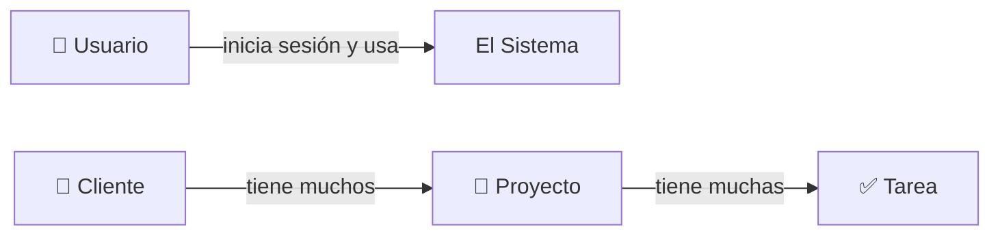

> Un **Cliente** puede tener **muchos** Proyectos. Un **Proyecto** puede tener **muchas** Tareas. Un Proyecto puede no tener cliente (entonces es "interno").

---

## 2. Conceptos básicos que necesitás entender

Si ya programaste web, salteá esta sección. Si no, leela: te va a ahorrar horas de confusión.

### 2.1 ¿Qué es el "Backend" y el "Frontend"?

- **Frontend** = todo lo que **ves y tocás** en el navegador (botones, tablas, formularios). En este proyecto está hecho con **Angular**.
- **Backend** = el "cerebro" que está en un servidor, **guarda los datos y aplica las reglas**. Acá está hecho con **NestJS** y una base de datos **PostgreSQL**.

El frontend **no toca la base de datos directamente**. Siempre le *pide* las cosas al backend.

### 2.2 ¿Qué es una API?

Una **API** es la "puerta de entrada" del backend. Es una lista de direcciones (URLs) a las que el frontend le habla. Por ejemplo:

- `GET /api/v1/proyectos` → "dame la lista de proyectos".
- `POST /api/v1/clientes` → "creá este cliente nuevo".

Esos verbos (`GET`, `POST`, etc.) se llaman **métodos HTTP**:

| Verbo | Significa | Ejemplo |
|-------|-----------|---------|
| `GET` | **Leer / traer** datos | Traer la lista de clientes |
| `POST` | **Crear** algo nuevo | Crear un proyecto |
| `PUT` | **Actualizar** algo que ya existe | Cambiar el estado de una tarea |

### 2.3 ¿Qué es JSON?

Es el "idioma" en que el frontend y el backend se mandan datos. Es texto con esta forma:

```json
{
  "nombre": "TechCorp",
  "estado": "ACTIVO"
}
```

### 2.4 ¿Qué es un Token JWT?

Cuando te logueás, el backend te da un **token** (un texto largo y encriptado). Es como una **pulsera de un boliche**: una vez que entraste, mostrás la pulsera y te dejan pasar sin volver a pedirte el DNI. Cada pedido al backend lleva ese token para demostrar que ya iniciaste sesión.

---

## 3. Vista de pájaro: la arquitectura completa

Así viaja la información, desde que hacés clic hasta que se guarda en la base de datos:

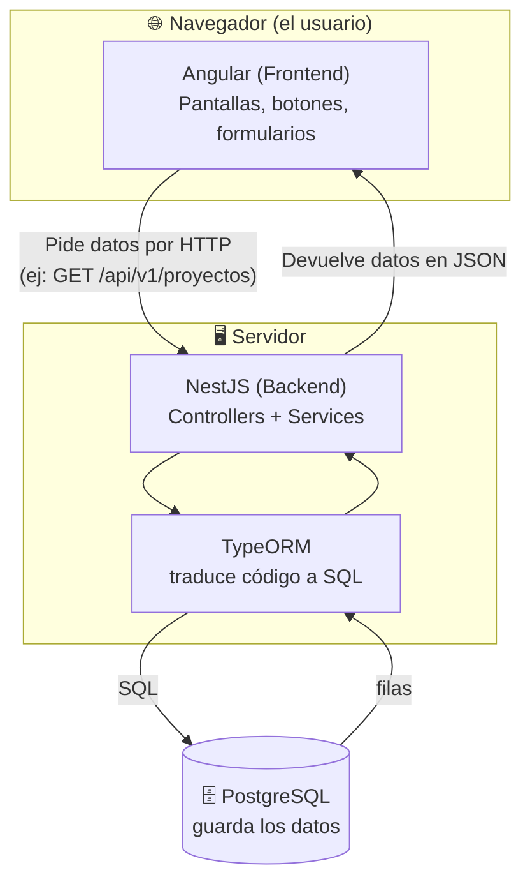

**En criollo:**
1. El usuario hace clic en "Proyectos" en el navegador.
2. Angular le pide al backend la lista (`GET /api/v1/proyectos`).
3. NestJS recibe el pedido, aplica reglas y le pide los datos a TypeORM.
4. TypeORM traduce eso a una consulta **SQL** y se la manda a PostgreSQL.
5. PostgreSQL devuelve las filas → TypeORM → NestJS → las convierte en JSON → Angular las muestra en una tabla.

### El stack tecnológico (qué herramienta hace qué)

| Capa | Herramienta | Para qué sirve |
|------|-------------|----------------|
| Frontend | **Angular 21** | Construir las pantallas |
| Frontend | **PrimeNG** | Componentes visuales lindos (tablas, botones, diálogos) |
| Frontend | **Chart.js** | Los gráficos del dashboard |
| Backend | **NestJS 11** | Organizar la API y la lógica |
| Backend | **TypeORM** | Hablar con la base de datos sin escribir SQL a mano |
| Backend | **JWT + bcrypt** | Login seguro y contraseñas encriptadas |
| Backend | **Swagger** | Documentación automática de la API |
| Base de datos | **PostgreSQL** | Guardar todo de forma permanente |

---

## 4. El modelo de datos (la base de datos)

Antes de ver código, hay que entender **cómo se guardan los datos**. La base tiene **4 tablas**. Este diagrama muestra las tablas y cómo se conectan (las "líneas" entre ellas son las relaciones):

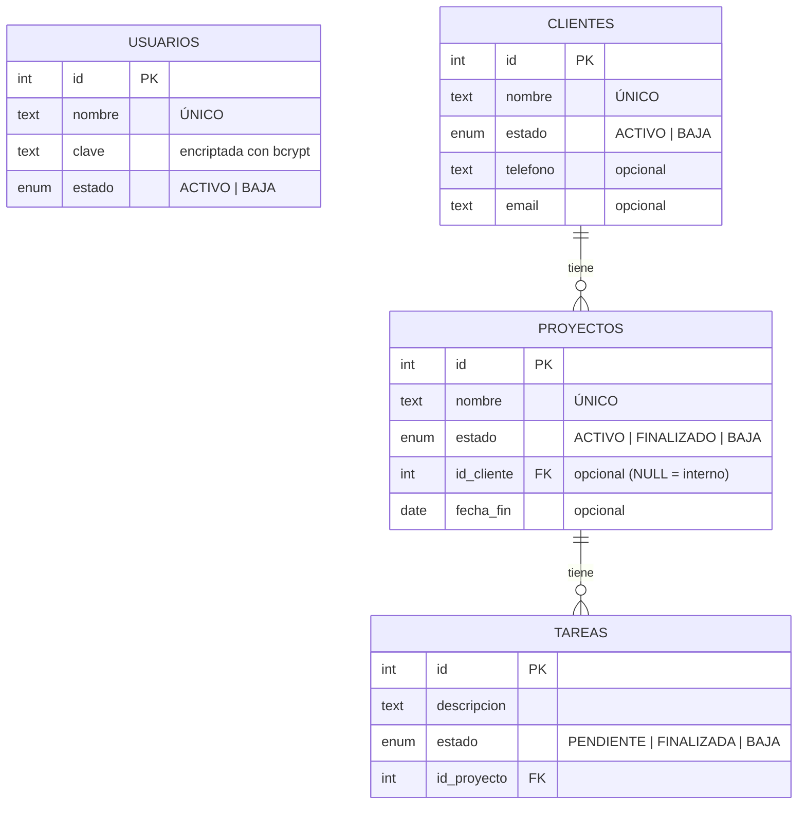

### Cómo leer ese diagrama

- **PK** (Primary Key) = el identificador único de cada fila (el "número de socio"). Siempre es `id`.
- **FK** (Foreign Key) = una columna que apunta a otra tabla. Ej: `proyectos.id_cliente` apunta a qué cliente pertenece el proyecto.
- `||--o{` significa **"uno a muchos"**: un cliente tiene muchos proyectos; un proyecto tiene muchas tareas.

### Los "estados" (enums)

Casi todo en el sistema tiene un **estado**. Esto es clave porque en este proyecto **nunca se borra nada físicamente**: en vez de borrar, se cambia el estado a `BAJA` (esto se llama **borrado lógico**).

```
Usuarios:   ACTIVO | BAJA
Clientes:   ACTIVO | BAJA
Proyectos:  ACTIVO | FINALIZADO | BAJA
Tareas:     PENDIENTE | FINALIZADA | BAJA
```

> 💡 **¿Por qué borrado lógico?** Porque si borrás un cliente que tenía proyectos, perdés el historial. Marcándolo como `BAJA`, el dato sigue ahí pero "desactivado".

### El script que crea la base

El archivo `backend/guia_tecnica_para_elequipo/Script_BD.sql` es el que crea todo esto. Sus partes:

```sql
-- 1. Crea los tipos de estado
CREATE TYPE estados_clientes AS ENUM ('ACTIVO','BAJA');
-- ...

-- 2. Crea las tablas
CREATE TABLE clientes ( id SERIAL PRIMARY KEY, nombre TEXT NOT NULL UNIQUE, ... );

-- 3. Crea el primer usuario (para poder loguearte): usuario / clave
CREATE EXTENSION IF NOT EXISTS pgcrypto;
insert into usuarios (nombre, clave, estado)
  values ('usuario', crypt('clave', gen_salt('bf', 10)), 'ACTIVO');
```

> 🔑 **Usuario inicial para probar:** nombre `usuario`, clave `clave`.

---

## 5. El Backend (NestJS) explicado de cero

### 5.1 ¿Cómo está organizado NestJS?

NestJS organiza el código en **módulos**. Pensá en un módulo como una "caja" que agrupa todo lo relacionado a un tema. Este proyecto tiene 2 cajas grandes:

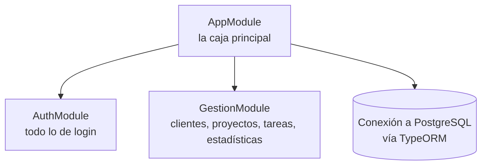

Dentro de cada módulo, el código se divide en **piezas con roles bien definidos**. Esta es la parte más importante de entender:

| Pieza | Su trabajo | Analogía (un restaurante) |
|-------|-----------|---------------------------|
| **Controller** | Recibe los pedidos HTTP y responde. No tiene lógica. | El **mozo**: toma tu pedido y te trae el plato. |
| **Service** | Contiene la **lógica de negocio** y las reglas. | El **cocinero**: prepara la comida con las reglas de la cocina. |
| **Entity** | Representa una tabla de la base de datos. | La **receta/molde** de cada plato. |
| **DTO** | Define la "forma" de los datos que entran o salen. | La **comanda**: qué se pidió exactamente. |
| **Guard** | Vigila que tengas permiso (token válido). | El **seguridad** de la puerta. |
| **Enum** | Lista cerrada de valores posibles (los estados). | El **menú fijo**: solo podés elegir de esa lista. |

### 5.2 Estructura de carpetas del backend

```
backend/src/
├── main.ts                      # Arranque de la app (configura puerto, seguridad, Swagger)
├── app.module.ts                # Caja principal: conecta todo + la base de datos
└── modules/
    ├── auth/                    # 🔐 LOGIN
    │   ├── controllers/         #   auth.controller.ts
    │   ├── services/            #   auth.service.ts, usuarios.service.ts
    │   ├── entities/            #   usuario.entity.ts
    │   ├── guards/              #   auth.guard.ts (el "seguridad")
    │   ├── dtos/input/          #   login.dto.ts
    │   └── enums/
    └── gestion/                 # 📁 EL NEGOCIO
        ├── controllers/         #   clientes, proyectos, tareas, estadisticas
        ├── services/            #   la lógica de cada uno
        ├── entities/            #   cliente, proyecto, tarea
        ├── dtos/
        │   ├── input/           #   create-*.dto.ts, update-*.dto.ts (lo que ENTRA)
        │   └── output/          #   list-*.dto.ts, *.dto.ts (lo que SALE)
        └── enums/
```

### 5.3 El arranque: `main.ts`

Este archivo configura cosas importantes para **toda** la app:

```5:23:SistemaGestionProyectos/backend/src/main.ts
  const app = await NestFactory.create(AppModule);

  app.use(helmet());

  const globalPrefix = 'api';

  app.setGlobalPrefix(globalPrefix);

  app.enableVersioning({
    type: VersioningType.URI,
    defaultVersion: '1',
  });

  app.useGlobalPipes(
    new ValidationPipe({ whitelist: true, forbidNonWhitelisted: true }),
  );
```

Qué hace cada línea, en simple:

- `helmet()` → agrega cabeceras de **seguridad** HTTP.
- `setGlobalPrefix('api')` → todas las URLs empiezan con `/api`.
- `enableVersioning` con `defaultVersion '1'` → agrega `/v1`. Por eso la base de todo es **`/api/v1`**.
- `ValidationPipe({ whitelist: true, forbidNonWhitelisted: true })` → **rechaza datos basura**: si mandás un campo que no está permitido, lo corta con error 400. Esto usa los DTOs (ya los vemos).

> 🌐 **URL base de toda la API:** `http://localhost:3000/api/v1`
> 📖 **Swagger** (probador visual de la API): `http://localhost:3000/api`

### 5.4 El flujo de una petición (paso a paso)

Cuando llega un pedido al backend, pasa por una "cadena de montaje":

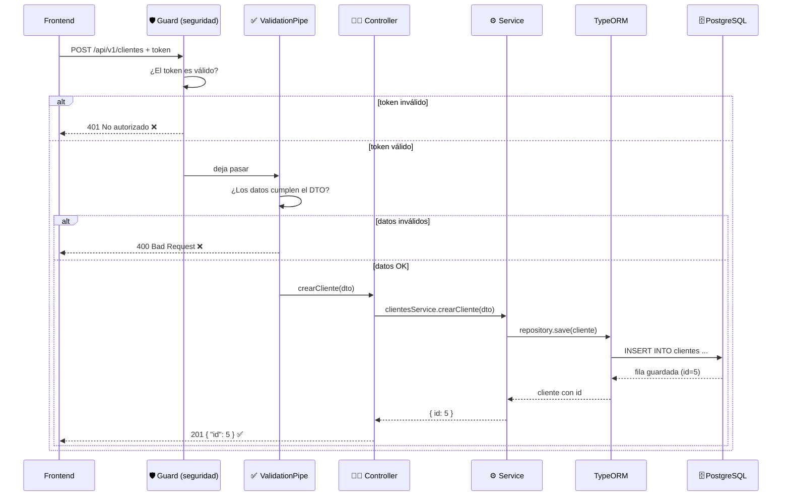

---

## 6. La autenticación con JWT (el "carnet" de entrada)

Esta es la parte de **login**. Vive en `modules/auth/`.

> ⚠️ **La confusión más común con JWT:** el token se **entrega una sola vez** (en el login). Los demás endpoints **no devuelven** token: esperan que vos se los **mandes** en la cabecera `Authorization: Bearer <token>`. Si no lo mandás, te rechazan con `401`.

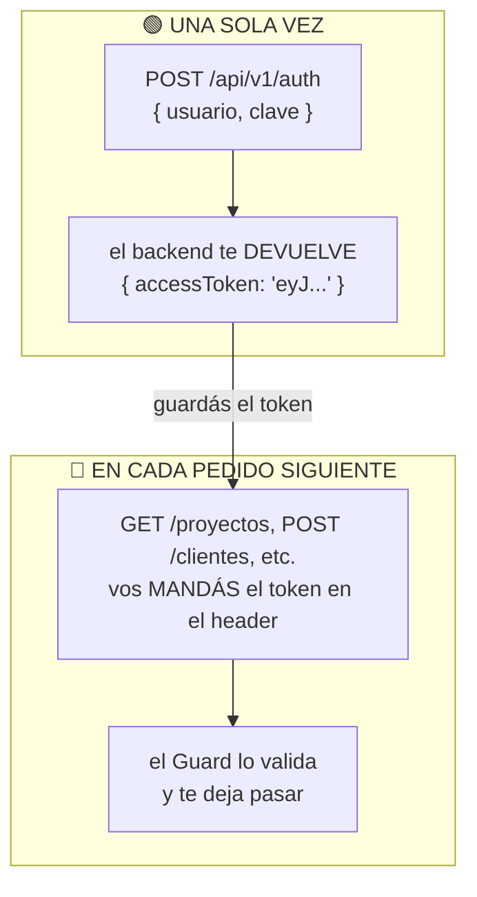

- En **Swagger** lo hacés a mano: copiás el token del login y lo pegás en el botón **"Authorize"**.
- En el **frontend** es automático: el `authInterceptor` pega el token en cada pedido por vos.

### 6.1 Qué pasa cuando te logueás

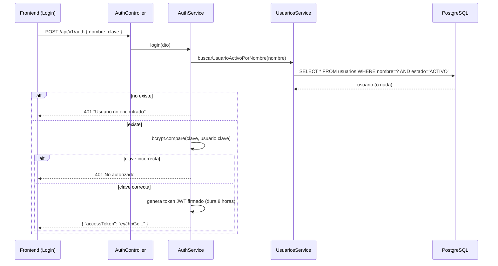

### 6.2 El código del login

El **controller** solo recibe y delega (es el mozo):

```14:17:SistemaGestionProyectos/backend/src/modules/auth/controllers/auth.controller.ts
    @Post("")
    async login(@Body() dto: LoginDto): Promise<{accessToken: string}>{
        return await this.authService.login(dto);
    }
```

El **service** tiene la lógica real (es el cocinero):

```13:29:SistemaGestionProyectos/backend/src/modules/auth/services/auth.service.ts
    async login(dto: LoginDto): Promise<{ accessToken: string }> {

        const usuario = await this.usuariosService.buscarUsuarioActivoPorNombre(dto.nombre);

        if (!usuario) {
            throw new UnauthorizedException("Usuario no encontrado");
        }

        if (!bcrypt.compareSync(dto.clave, usuario.clave)) {
            throw new UnauthorizedException();
        }

        const payload = { nombre: usuario.nombre, sub: usuario.id };

        return {
            accessToken: this.jwtService.sign(payload)
        };
    }
```

**Puntos clave:**
- La contraseña **nunca se guarda en texto plano**. Se guarda encriptada con `bcrypt`. Al loguearte, `bcrypt.compareSync` compara sin desencriptar.
- Si todo está bien, se genera un **token JWT** que dura **8 horas** (configurado en `auth.module.ts`).

### 6.3 El "seguridad" de la puerta: `AuthGuard`

Casi todos los endpoints (salvo el login) están protegidos. El `AuthGuard` revisa que vengas con un token válido:

```8:21:SistemaGestionProyectos/backend/src/modules/auth/guards/auth.guard.ts
    async canActivate(context: ExecutionContext): Promise<boolean> {
        const request = context.switchToHttp().getRequest();
        const token = this.extractTokenFromHeader(request);
        if (!token) {
            throw new UnauthorizedException();
        }
        try {
            const payload = await this.jwtService.verifyAsync(token);
            request['usuario'] = payload;
        } catch {
            throw new UnauthorizedException();
        }
        return true;
    }
```

En los controllers, protegés un endpoint con la línea `@UseGuards(AuthGuard)`. Si la ves arriba de un método, ese endpoint **exige token**.

---

## 7. Los módulos de negocio del backend

Todo esto vive en `modules/gestion/`. Hay 4 áreas: **Clientes**, **Proyectos**, **Tareas** y **Estadísticas**.

### 7.1 Clientes

**Controller** (`clientes.controller.ts`) → 3 endpoints: crear, actualizar, listar (con filtro opcional por estado).

**Service** (`clientes.service.ts`) → la lógica. Lo más importante:

- **Crear:** todo cliente nace con estado `ACTIVO`.
- **Actualizar:** acá hay una **regla de negocio fuerte** — no se puede dar de baja un cliente que tiene proyectos:

```26:42:SistemaGestionProyectos/backend/src/modules/gestion/services/clientes.service.ts
    async actualizarCliente(id: number, dto: UpdateClienteDto): Promise<void> {

        const cliente: Cliente | null = await this.repository.findOneBy({ id });

        if (!cliente) {
            throw new BadRequestException('Cliente no encontrado');
        }

        const relacionadoConProyectos: boolean = await this.proyectosService.existeProyectoPorIdCliente(id);

        if (relacionadoConProyectos && dto.estado === EstadosClientesEnum.BAJA) {
            throw new BadRequestException('No se puede dar de baja un cliente con proyectos relacionados');
        }

        this.repository.merge(cliente, dto);
        await this.repository.save(cliente);
    }
```

- **Listar:** trae los clientes, opcionalmente filtrando por `?estado=ACTIVO`.

### 7.2 Proyectos

**Controller** (`proyectos.controller.ts`) → 4 endpoints: crear, actualizar, listar todos, ver uno (con detalle).

**Service** (`proyectos.service.ts`) → reglas importantes:

- **Crear/Actualizar:** si le pasás un cliente, ese cliente **tiene que estar activo**. Si no, error:

```25:35:SistemaGestionProyectos/backend/src/modules/gestion/services/proyectos.service.ts
        if (dto.idCliente) {

            const clienteActivo: boolean = await this.clientesService.existeClienteActivoPorId(dto.idCliente);

            if (!clienteActivo) {
                throw new BadRequestException('Se debe especificar un cliente activo para el proyecto');
            }
        }

        await this.repository.save(proyecto);
        return { id: proyecto.id };
```

- **Si no pasás cliente** (`idCliente` es nulo) → el proyecto es **interno**. Perfectamente válido.
- **Ver uno** (`GET /proyectos/:id`) → trae el proyecto **con sus tareas y su cliente** incluidos. Esto es lo que usa la pantalla de tareas.

> 🔄 **Detalle técnico:** `ClientesService` y `ProyectosService` se necesitan mutuamente (uno valida cosas del otro). Para que NestJS no se confunda con esa dependencia circular, se usa `forwardRef(() => ...)`. No te preocupes por esto al principio.

### 7.3 Tareas

**Controller** (`tareas.controller.ts`) → ojo con la ruta: las tareas **viven dentro de un proyecto**. Por eso la ruta es:

```
/api/v1/proyectos/:idProyecto/tareas
```

Tiene 2 endpoints: crear una tarea en un proyecto, y actualizar una tarea.

**Service** (`tarea.service.ts`):
- **Crear:** la tarea nace `PENDIENTE` y se asocia automáticamente al `idProyecto` de la URL.
- **Actualizar:** cambia descripción o estado. Mover una tarea a `BAJA` es el "borrado lógico" de tareas.

### 7.4 Estadísticas

**Controller** (`estadisticas.controller.ts`) → 1 endpoint: `GET /api/v1/estadisticas`. Alimenta el dashboard.

**Service** (`estadisticas.service.ts`) → cuenta cosas en la base:
- Cuántos proyectos hay por estado (activos, finalizados, baja).
- Cuántas tareas por estado.
- Cuántos clientes por estado.
- Cuántos proyectos tiene cada cliente (esto usa una consulta más avanzada con `GROUP BY`).

Devuelve todo junto en un solo objeto `EstadisticasDTO`, listo para dibujar los gráficos.

### 7.5 Entrada y salida: los DTOs

Un **DTO** (Data Transfer Object) define **la forma exacta** de los datos. Hay de dos tipos:

- **Input DTOs** (`create-*`, `update-*`): lo que el frontend **manda**. Acá viven las **validaciones**. Ejemplo:

```4:19:SistemaGestionProyectos/backend/src/modules/gestion/dtos/input/create-cliente.dto.ts
export class CreateClienteDto {

    @ApiProperty()
    @IsString()
    @IsNotEmpty()
    nombre!: string;

    @ApiPropertyOptional()
    @IsOptional()
    @IsString()
    telefono?: string;

    @ApiPropertyOptional()
    @IsOptional()
    @IsEmail()
    email?: string;

}
```

Esos decoradores (`@IsString`, `@IsNotEmpty`, `@IsEmail`) son las reglas. Si mandás un `nombre` vacío, el backend responde **400** automáticamente, sin que el programador escriba ningún `if`.

- **Output DTOs** (`list-*`, `proyecto.dto`): lo que el backend **devuelve**. Sirven para **no exponer datos de más** (por ejemplo, nunca devuelve la contraseña del usuario).

> 💡 Truco: `UpdateClienteDto extends PartialType(CreateClienteDto)` significa "lo mismo que crear, pero todos los campos son opcionales, más el campo `estado`".

---

## 8. Las reglas de negocio (lo que el sistema NO te deja hacer)

Estas son las reglas que la consigna pide y que están programadas. Memorizalas, porque explican muchos errores "raros":

| # | Regla | Qué pasa si la violás |
|---|-------|------------------------|
| 1 | Un proyecto solo se asocia a un **cliente activo**. | `400 "Se debe especificar un cliente activo para el proyecto"` |
| 2 | No se puede dar de **baja un cliente que tiene proyectos**. | `400 "No se puede dar de baja un cliente con proyectos relacionados"` |
| 3 | Un proyecto **sin cliente** es válido = proyecto **interno**. | Se crea normalmente |
| 4 | **Nada se borra físicamente.** Todo es borrado lógico con estado `BAJA`. | — |
| 5 | Todos los usuarios ven **todos** los datos (no hay datos privados por usuario). | — |
| 6 | Sin **token válido**, no entrás a ningún endpoint (salvo login). | `401 Unauthorized` |
| 7 | Datos que no cumplen el **DTO** se rechazan. | `400 Bad Request` |

---

## 9. Tabla completa de endpoints

Base: `http://localhost:3000/api/v1`. Todos requieren token **excepto el login**.

| Método | Ruta | Qué hace | Token |
|--------|------|----------|:-----:|
| `POST` | `/auth` | Iniciar sesión, devuelve el token | ❌ |
| `POST` | `/clientes` | Crear un cliente | ✅ |
| `PUT` | `/clientes/:id` | Actualizar/dar de baja un cliente | ✅ |
| `GET` | `/clientes?estado=` | Listar clientes (filtro opcional) | ✅ |
| `POST` | `/proyectos` | Crear un proyecto | ✅ |
| `PUT` | `/proyectos/:id` | Actualizar un proyecto | ✅ |
| `GET` | `/proyectos` | Listar todos los proyectos | ✅ |
| `GET` | `/proyectos/:id` | Ver un proyecto con sus tareas | ✅ |
| `POST` | `/proyectos/:idProyecto/tareas` | Crear una tarea en un proyecto | ✅ |
| `PUT` | `/proyectos/:idProyecto/tareas/:id` | Actualizar/mover una tarea | ✅ |
| `GET` | `/estadisticas` | Traer datos para el dashboard | ✅ |

---

## 10. El Frontend (Angular) explicado de cero

Ahora pasamos al **navegador**: la parte que el usuario ve. Está en `frontend/` y usa **Angular 21**.

### 10.1 ¿Cómo piensa Angular?

Angular arma las pantallas con **componentes**. Un componente es un "ladrillo" de pantalla y siempre tiene 3 archivos juntos:

| Archivo | Contenido | Analogía |
|---------|-----------|----------|
| `algo.ts` | La **lógica** (variables, funciones, llamadas a la API). | El cerebro |
| `algo.html` | La **estructura visual** (lo que se ve). | El esqueleto |
| `algo.css` | Los **estilos** (colores, tamaños). | La ropa |

### 10.2 Estructura de carpetas del frontend

```
frontend/src/app/
├── app.ts / app.html / app.config.ts   # Arranque y configuración global
├── app.routes.ts                        # El "mapa" de URLs → qué pantalla mostrar
├── auth/                                # 🔐 Login y manejo del token
│   ├── login/                           #   La pantalla de login
│   ├── auth-store.ts                    #   Guarda/lee el token
│   ├── auth-interceptor.ts              #   Pega el token en cada pedido
│   └── auth.guard.ts                    #   Bloquea pantallas sin login
├── template/                            # 🎨 El "marco" (menú lateral + barra superior)
├── dashboard/                           # 📊 Pantalla de estadísticas
├── shared/                              # 🛠️ Utilidades (ej: exportar CSV)
└── proyectos/
    ├── listado/                         # 📁 Tabla de proyectos
    ├── gestion/                         #   Modal para crear/editar proyecto
    ├── clientes/                        # 👥 Pantalla y modal de clientes
    └── tareas/
        ├── listado/                     # ✅ Tabla de tareas
        ├── kanban/                      #   Tablero arrastrable de tareas
        └── gestion/                     #   Modal para crear/editar tarea
```

### 10.3 El "mapa" de pantallas: `app.routes.ts`

Las **rutas** dicen "si la URL es X, mostrá la pantalla Y":

```10:49:SistemaGestionProyectos/frontend/src/app/app.routes.ts
export const routes: Routes = [
    {
        path: '',
        pathMatch: 'full',
        redirectTo: 'dashboard'
    },
    {
        path: "login",
        component: Login
    },
    {
        path: 'dashboard',
        component: Dashboard,
        canActivate: [authGuard]
    },
    {
        path: 'clientes',
        component: ClientesPage,
        canActivate: [authGuard]
    },
    {
        path: 'proyectos/:id/tareas/kanban',
        component: TareasKanban,
        canActivate: [authGuard]
    },
    {
        path: 'proyectos/:id/tareas',
        component: TareasListado,
        canActivate: [authGuard]
    },
    {
        path: 'proyectos',
        component: ProyectosListado,
        canActivate: [authGuard]
    },
    {
        path: "**",
        redirectTo: "login"
    }
];
```

- `canActivate: [authGuard]` → **esta pantalla exige estar logueado**. Si no tenés token, te manda al login.
- `path: "**"` → cualquier URL desconocida va al login.

### 10.4 El manejo del token en el frontend (3 piezas)

Estas 3 piezas trabajan juntas para que el login "funcione mágicamente" en toda la app:

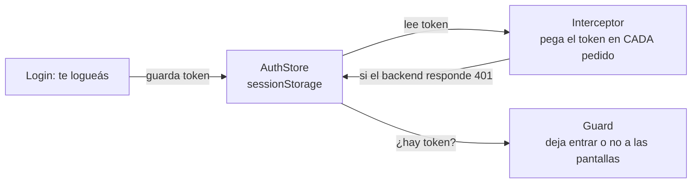

**1) `AuthStore`** — guarda, lee y borra el token (lo guarda en `sessionStorage` del navegador):

```10:22:SistemaGestionProyectos/frontend/src/app/auth/auth-store.ts
    guardarToken(token: string): void {
        sessionStorage.setItem("accessToken", token);
    }

    obtenerToken(): string | null {
        return sessionStorage.getItem("accessToken");
    }

    cerrarSesion(): void {
        sessionStorage.removeItem("accessToken");
        this.router.navigateByUrl("/login");
    }
```

**2) `authInterceptor`** — intercepta **todos** los pedidos HTTP y les pega el token automáticamente. También: si el backend responde `401` (token vencido), cierra la sesión:

```14:29:SistemaGestionProyectos/frontend/src/app/auth/auth-interceptor.ts
  if (!authToken) {
    return next(req);
  }

  const reqWithToken = req.clone({
    headers: req.headers.set('Authorization', `Bearer ${authToken}`)
  });

  return next(reqWithToken).pipe(
    catchError((error: HttpErrorResponse) => {
      if (error.status === 401) {
        authStore.cerrarSesion();
      }
      return throwError(() => error);
    })
  );
```

**3) `authGuard`** — el "portero" de las pantallas. Si no hay token, redirige al login:

```5:16:SistemaGestionProyectos/frontend/src/app/auth/auth.guard.ts
export const authGuard: CanActivateFn = () => {

    const authStore: AuthStore = inject(AuthStore);
    const router: Router = inject(Router);

    if (authStore.obtenerToken()) {
        return true;
    }

    return router.createUrlTree(["/login"]);

};
```

### 10.5 El patrón "API Client" (cómo el frontend habla con el backend)

Cada área tiene un archivo `*-api-client.ts` cuyo **único trabajo** es hacer los pedidos HTTP. Esto mantiene el código ordenado: los componentes no hablan con el backend directamente, le piden al API Client.

Ejemplo, el de proyectos:

```9:16:SistemaGestionProyectos/frontend/src/app/proyectos/listado/proyectos-listado-api-client.ts
export class ProyectosListadoApiClient {

    private readonly httpClient = inject(HttpClient);
    
    buscarProyectos(): Observable<ListProyectoDTO[]> {
        return this.httpClient.get<ListProyectoDTO[]>('/api/v1/proyectos');
    }

}
```

> 🔌 **¿Cómo llega `/api/v1/...` al backend?** En desarrollo, el archivo `frontend/src/proxy.conf.json` redirige todo lo que empieza con `/api` hacia `http://localhost:3000` (el backend). Así no hay problemas de CORS.

### 10.6 El "marco" de la app: `template`

Casi todas las pantallas se dibujan **dentro** del componente `Template`, que provee:
- El **menú lateral** (Dashboard, Proyectos, Clientes).
- La **barra superior** con el título y el botón de "Cerrar sesión".

Las pantallas ponen su contenido adentro usando `<ng-content>`. Es como un cuadro con marco: el marco siempre es el mismo, lo que cambia es la foto del medio.

---

## 11. Cada pantalla del frontend, una por una

### 11.1 Login (`auth/login`)

Un formulario con usuario y clave. Al enviar:
1. Llama a `loginApiClient.iniciarSesion(...)`.
2. Si sale bien, **guarda el token** y te lleva a `/proyectos`.
3. Si falla, muestra un mensaje de error (un "toast").

```43:51:SistemaGestionProyectos/frontend/src/app/auth/login/login.ts
        this.loginApiClient.iniciarSesion(nombre, clave).subscribe({
            next: (data)=>{
                this.authStore.guardarToken(data.accessToken);
                this.router.navigateByUrl("/proyectos");
            },
            error: (err)=>{
                this.messageService.add({severity: "error", summary: "Ha ocurrido un error al iniciar sesión"})
            }
        });
```

### 11.2 Dashboard (`dashboard`)

La pantalla de estadísticas. Al cargar, pide `GET /api/v1/estadisticas` y arma **3 gráficos** con Chart.js:
- Proyectos por estado (dona).
- Tareas por estado (dona).
- Proyectos por cliente (barras horizontales).

Maneja 3 estados visuales: `cargando` (spinner), `error` (mensaje) y datos listos (gráficos).

### 11.3 Listado de Proyectos (`proyectos/listado`)

Una tabla (de PrimeNG) con todos los proyectos. Permite:
- **Filtrar y buscar**.
- **Crear** un proyecto (abre el modal de gestión).
- **Editar** un proyecto.
- **Ir a las tareas** de un proyecto.
- **Exportar a CSV**.

Tiene un detalle elegante: cada vez que se **cierra el modal**, refresca la lista automáticamente, usando un `effect`:

```40:46:SistemaGestionProyectos/frontend/src/app/proyectos/listado/proyectos-listado.ts
  constructor() {
    effect(() => {
      if (!this.dialogVisible()) {
        this.refrescarProyectos();
      }
    });
  }
```

### 11.4 Crear/Editar Proyecto (`proyectos/gestion`)

Un **modal** (ventana emergente) con un formulario. Es inteligente:
- Si recibe un proyecto → modo **"Editar"**. Si no → modo **"Crear"**.
- Tiene una validación especial: si el estado es `FINALIZADO`, la **fecha de fin pasa a ser obligatoria**.
- Permite elegir el cliente de una lista (solo clientes **activos**).
- Convierte las fechas entre el formato del calendario y el formato que espera el backend (`YYYY-MM-DD`).

### 11.5 Clientes (`proyectos/clientes`)

La pantalla `ClientesPage` muestra la tabla de clientes con búsqueda, exportación a CSV y un modal (`GestionCliente`) para crear/editar. El formulario valida que el email tenga formato válido. Recordá la regla: si intentás dar de baja un cliente con proyectos, el **backend** lo rechaza y se muestra el error.

### 11.6 Listado de Tareas (`proyectos/tareas/listado`)

Llega desde un proyecto (`/proyectos/:id/tareas`). Pide el proyecto completo con `GET /proyectos/:id` y muestra sus tareas en una tabla. Desde acá podés crear/editar tareas o saltar a la **vista Kanban**.

### 11.7 Kanban de Tareas (`proyectos/tareas/kanban`)

La pantalla más vistosa: un **tablero de 3 columnas** (Pendientes, Finalizadas, Baja) donde **arrastrás las tarjetas** de una columna a otra para cambiarles el estado.

Cómo funciona el arrastrar y soltar:

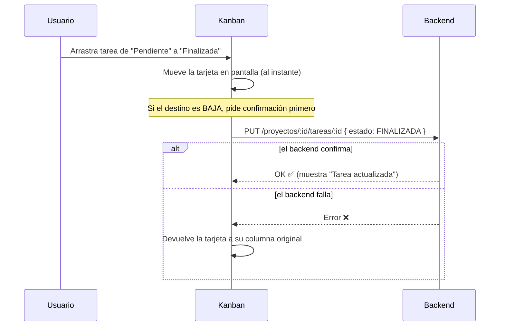

Esto es lo que se llama **"actualización optimista"**: la tarjeta se mueve **inmediatamente** (para que se sienta rápido), y si el backend falla, se revierte sola. Mover algo a `BAJA` pide confirmación porque es un borrado lógico.

### 11.8 Exportar a CSV (`shared/csv-export.ts`)

Una utilidad reutilizable que convierte cualquier tabla en un archivo `.csv` que abre bien en Excel en español (usa `;` como separador y agrega un "BOM" para que los acentos se vean bien). La usan las pantallas de proyectos, clientes y tareas.

---

## 12. El viaje completo de un dato (de punta a punta)

Esta es la sección **más visual** de toda la doc. Si solo tenés 5 minutos, mirá los diagramas de acá: cada uno muestra una operación real **atravesando las dos mitades** (frontend → backend → base de datos → y la vuelta).

Todos los flujos siguen el **mismo patrón** (es la idea central del proyecto):

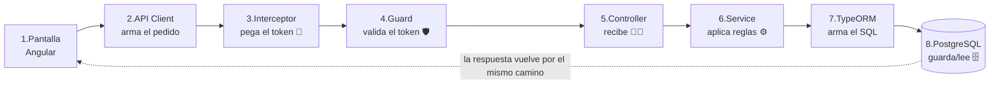

> 💡 **Regla de oro:** cambia el "qué" (cliente, proyecto, tarea), pero las **8 estaciones del viaje son siempre las mismas**. Si entendés un flujo, los entendés todos.

### 12.0 Mapa de navegación (cómo se mueve el usuario)

Antes de los flujos técnicos, así navega una persona por las pantallas:

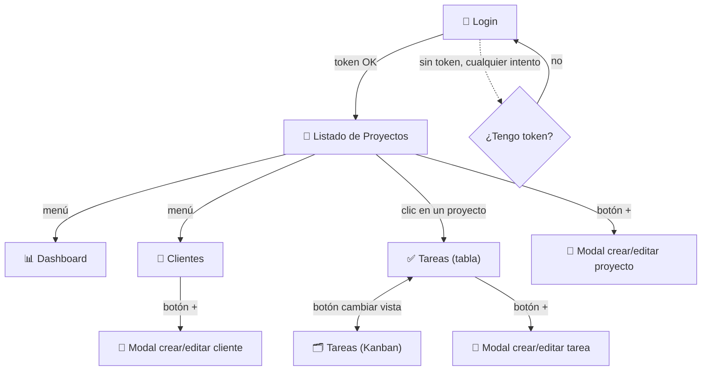

### 12.1 Flujo 1 — Iniciar sesión (de punta a punta)

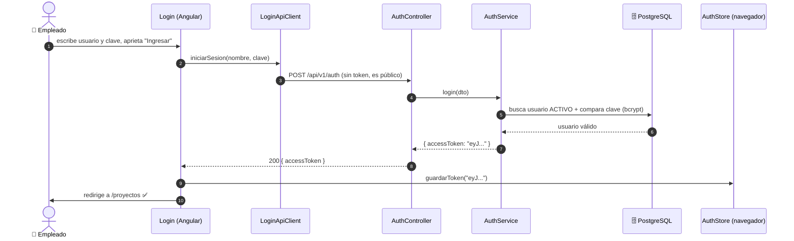

### 12.2 Flujo 2 — Crear una tarea

*"Un empleado crea una tarea nueva en un proyecto"*. Notá cómo aparecen el interceptor y el guard (que en el login no estaban, porque era público):

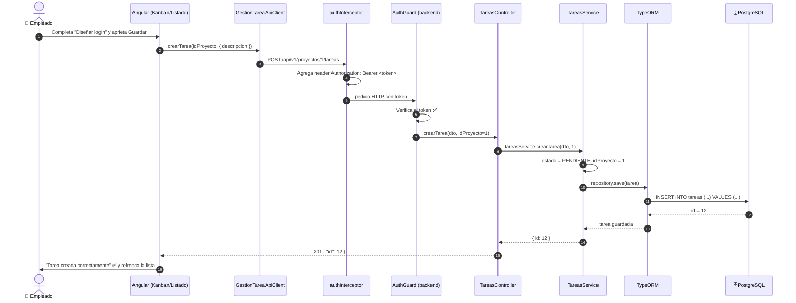

### 12.3 Flujo 3 — Crear un proyecto (con una regla de negocio)

Acá se ve cómo el **Service aplica una regla** y puede **rechazar** el pedido. Un service le pregunta a otro (`ProyectosService` → `ClientesService`):

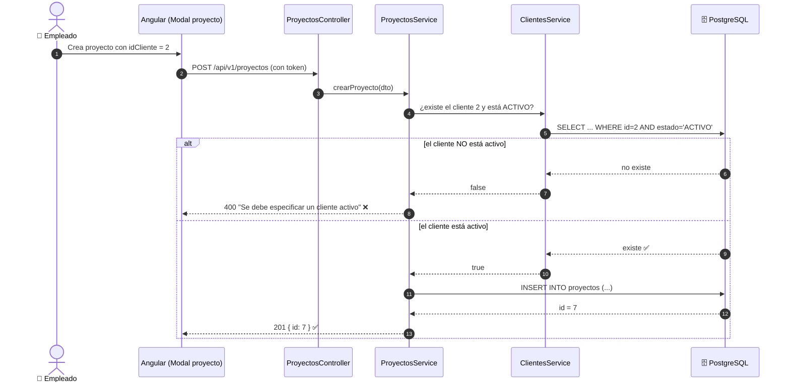

### 12.4 Flujo 4 — Mover una tarea en el Kanban (actualización optimista)

Lo interesante acá es que la tarjeta se mueve **al instante** en pantalla, y si el backend falla, **se revierte sola**:

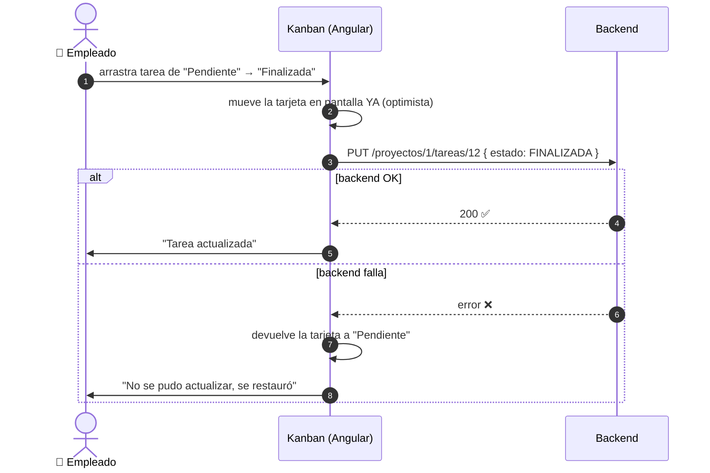

### 12.5 Flujo 5 — Cargar el Dashboard

Una sola llamada trae todos los números, y el frontend los convierte en 3 gráficos:

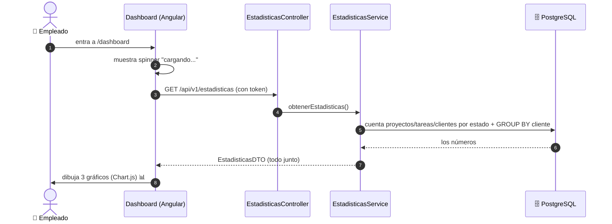

> ✅ **Lo que tienen en común los 5 flujos:** salvo el login (que es público), **todos** pasan por el interceptor (pone el token) y el guard (lo valida). Esa es la columna vertebral de la app.

---

## 13. Cómo levantar todo el proyecto

### 13.1 Requisitos previos
- **Node.js** y **npm** instalados.
- **PostgreSQL** instalado y corriendo.

### 13.2 Backend

```bash
# 1. Arrancar PostgreSQL
sudo systemctl start postgresql

# 2. Crear la base de datos
sudo -u postgres psql -c "CREATE DATABASE gestion_proyectos;"

# 3. Cargar tablas + usuario inicial
sudo -u postgres psql -d gestion_proyectos \
  -f "backend/guia_tecnica_para_elequipo/Script_BD.sql"

# 4. (opcional) Cargar datos de prueba
sudo -u postgres psql -d gestion_proyectos \
  -f "backend/guia_tecnica_para_elequipo/datos_prueba.sql"

# 5. Instalar dependencias y levantar
cd backend
npm install
npm run start:dev        # → http://localhost:3000/api  (Swagger)
```

> Verificá que `backend/.env` tenga la `DB_PASSWORD` correcta de tu PostgreSQL.

### 13.3 Frontend

```bash
cd frontend
npm install
npm start                # → http://localhost:4200
```

### 13.4 Probar

1. Abrí `http://localhost:4200`.
2. Logueate con **`usuario`** / **`clave`**.
3. ¡Listo! Ya podés navegar proyectos, clientes, tareas y el dashboard.

### 13.5 URLs útiles

| URL | Qué es |
|-----|--------|
| `http://localhost:4200` | La aplicación (frontend) |
| `http://localhost:3000/api/v1` | La API (backend) |
| `http://localhost:3000/api` | **Swagger** (probar endpoints a mano) |
| `http://localhost:8081` | **Compodoc** (docs autogeneradas del código, con `npm run compodoc`) |

---

## 14. Glosario rápido

| Término | Significado en una línea |
|---------|--------------------------|
| **API** | La lista de URLs por las que el frontend le habla al backend. |
| **Endpoint** | Una URL específica de la API (ej: `GET /clientes`). |
| **HTTP** | El protocolo de comunicación de la web (`GET`, `POST`, `PUT`...). |
| **JSON** | El formato de texto para mandar datos entre front y back. |
| **JWT / Token** | El "carnet" que prueba que iniciaste sesión. |
| **bcrypt** | La técnica para guardar contraseñas encriptadas. |
| **Backend** | El servidor: lógica + base de datos (NestJS). |
| **Frontend** | Lo que ves en el navegador (Angular). |
| **NestJS** | El framework del backend. |
| **Angular** | El framework del frontend. |
| **TypeORM** | La herramienta que traduce código a SQL. |
| **PostgreSQL** | La base de datos donde se guarda todo. |
| **Controller** | El "mozo": recibe pedidos HTTP y responde. |
| **Service** | El "cocinero": tiene la lógica y las reglas. |
| **Entity** | La representación de una tabla de la base. |
| **DTO** | El molde que define la forma de los datos (entrada/salida). |
| **Guard** | El "seguridad" que pide el token antes de dejar pasar. |
| **Enum** | Lista cerrada de valores posibles (los estados). |
| **Borrado lógico** | No borrar de verdad: marcar como `BAJA`. |
| **Componente (Angular)** | Un ladrillo de pantalla (`.ts` + `.html` + `.css`). |
| **Interceptor** | Pieza que toca todos los pedidos HTTP (acá: pega el token). |
| **Signal (Angular)** | La forma moderna de Angular de guardar datos que cambian en pantalla. |
| **CSV** | Archivo de tabla que abre en Excel. |

---

> 📌 **Documentos relacionados en esta carpeta:**
> - `README.md` → guía de setup paso a paso y pruebas con Swagger.
> - `CONTEXTO_PROYECTO.md` → estado detallado y decisiones del proyecto.
> - `backend/guia_tecnica_para_elequipo/logica-y-estructura.es.md` → lógica del backend.
>
> 💬 **Si algo no te queda claro, preguntá antes de tocar el código.** Esta doc existe para que todo el equipo trabaje con el mismo entendimiento. ¡A programar! 🚀
