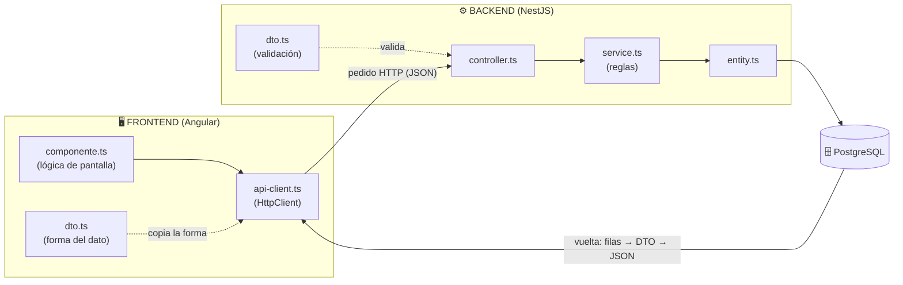
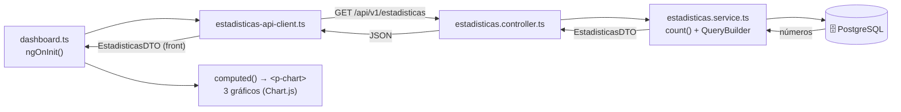
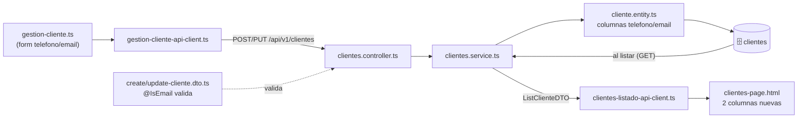
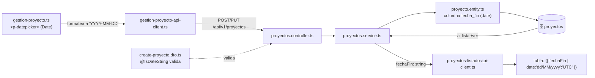
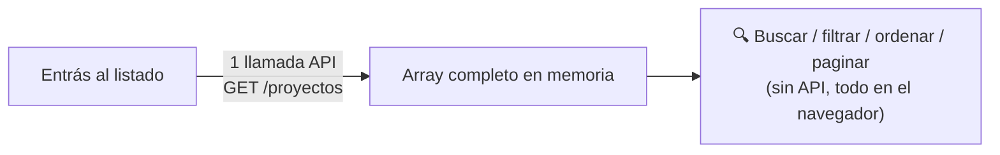
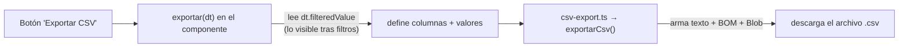
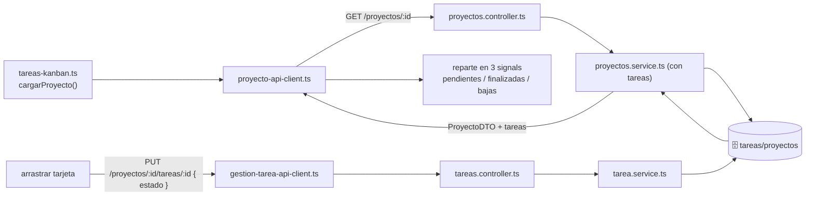

# Explicación de las 6 funcionalidades adicionales

**Sistema de Gestión de Proyectos · Trabajo Final Integrador 2026**
**Tecnicatura Universitaria en Desarrollo Web**

> Documento para que el equipo entienda **cómo funcionan** las 6 funcionalidades adicionales: su **estructura** (qué archivos intervienen), su **lógica**, y sobre todo **cómo se comunican los archivos del frontend al backend y del backend de vuelta al frontend**, punto por punto.

---

## 🎨 Las 6 funcionalidades adicionales (índice)

> Cada funcionalidad tiene su **color** para identificarla de un vistazo. Tocá el botón para saltar a su explicación detallada (estructura + lógica + flujo front ↔ back).

[](#rf15)
[](#rf19)
[](#rf20)
[](#rf16)
[](#rf17)
[](#rf18)

<h3 style="color:#2563EB">🟦 1 · RF15 — Estadísticas globales (Dashboard)</h3>

Endpoint que devuelve conteos agregados + un dashboard con 3 gráficos. **Toca backend: ✅ sí (módulo completo).** → **[Ver detalle ▸](#rf15)**

<h3 style="color:#16A34A">🟩 2 · RF19 — Datos de contacto de clientes (teléfono, email)</h3>

Dos campos opcionales en el cliente, en toda la cadena BD → entidad → DTO → formulario → tabla. **Toca backend: 🟡 mínimo.** → **[Ver detalle ▸](#rf19)**

<h3 style="color:#EA580C">🟧 3 · RF20 — Fecha de finalización de proyecto</h3>

Campo `fechaFin` opcional con date picker y validación condicional. **Toca backend: 🟡 mínimo.** → **[Ver detalle ▸](#rf20)**

<h3 style="color:#7C3AED">🟪 4 · RF16 — Búsqueda avanzada (filtro + orden + paginación)</h3>

Filtro de texto, filtro por estado, orden y paginación en los 3 listados. **Toca backend: ❌ no (100% frontend).** → **[Ver detalle ▸](#rf16)**

<h3 style="color:#CA8A04">🟨 5 · RF17 — Exportación a CSV</h3>

Botón que descarga lo visible como `.csv` (compatible con Excel español). **Toca backend: ❌ no (100% frontend).** → **[Ver detalle ▸](#rf17)**

<h3 style="color:#DC2626">🟥 6 · RF18 — Vista Kanban de tareas (drag & drop)</h3>

Tablero de 3 columnas donde se arrastran tarjetas para cambiar el estado. **Toca backend: ❌ no (reusa el `PUT` existente).** → **[Ver detalle ▸](#rf18)**

> 💡 **Leyenda:** 🟦🟩🟧 tocan el backend (entidad / service / DTO) · 🟪🟨🟥 son **100% frontend**. En total: **3 con cambios mínimos de backend** y **3 de frontend puro**.

---

## Conceptos generales (se repiten en todas)

Antes de entrar punto por punto, estos conceptos aplican a **todas** las funcionalidades. Si los tenés claros, todo lo demás se entiende más rápido.

- **Backend (NestJS):** patrón en capas `entity` → `service` → `controller` → `DTO`.
  - **Entity** = la tabla de la base. **Service** = la lógica/reglas. **Controller** = recibe el pedido HTTP. **DTO** = la forma de los datos que entran o salen.
  - Las columnas SQL van en `snake_case` y se mapean a `camelCase` con `@Column({ name: '...' })`.
- **Frontend (Angular 21 standalone, zoneless):** cada pantalla tiene `componente.ts` + `.html` + `.css`, usa **signals** para el estado y un **api-client** (servicio con `HttpClient`) para hablar con el backend. El token JWT viaja solo gracias al `auth-interceptor`.
- **La cadena de archivos siempre es la misma** (este es el corazón de "cómo interactúan front y back"):



- **Borrado lógico:** nunca se borra físico; se cambia el estado a `BAJA`.

---

<h2 id="rf15" style="color:#2563EB">🟦 1 · RF15 — Estadísticas globales (Dashboard)</h2>

### Qué hace
Un endpoint que devuelve conteos agregados (proyectos, tareas, clientes por estado + proyectos agrupados por cliente) y un dashboard con gráficos.

### Estructura (archivos que intervienen)

| Capa | Archivo | Rol |
|------|---------|-----|
| Backend · Service | `gestion/services/estadisticas.service.ts` | Corazón de la lógica (los conteos) |
| Backend · Controller | `gestion/controllers/estadisticas.controller.ts` | Expone `GET /api/v1/estadisticas` (con `AuthGuard`) |
| Backend · DTO salida | `gestion/dtos/output/estadisticas.dto.ts` | Define la forma de la respuesta |
| Frontend · DTO | `dashboard/estadisticas-dto.ts` | Interface que copia la forma del DTO del backend |
| Frontend · Api client | `dashboard/estadisticas-api-client.ts` | Hace la única llamada `GET /estadisticas` |
| Frontend · Componente | `dashboard/dashboard.{ts,html,css}` | Estados (cargando/error/ok) + gráficos |

### 🔄 Flujo de interacción (front ↔ back)



**En palabras:** el `dashboard.ts`, al iniciar, le pide datos al `api-client`; este llama al `controller`, que delega en el `service`; el service cuenta en PostgreSQL y arma el `EstadisticasDTO`; ese DTO vuelve como JSON hasta el `dashboard.ts`, que con `computed` signals dibuja los 3 gráficos.

### Lógica
La lógica del service usa dos técnicas:

**a) Conteos simples** con `repository.count({ where: { estado } })`, una consulta por cada estado (proyectos activos/finalizados/baja, tareas pendientes/finalizadas/baja, clientes activos/baja).

**b) Agrupación "proyectos por cliente"** con un `QueryBuilder` (SQL `GROUP BY` real):

```ts
const proyectosPorCliente = await this.proyectosRepository
    .createQueryBuilder('proyecto')
    .innerJoin('proyecto.cliente', 'cliente')
    .select('cliente.nombre', 'cliente')
    .addSelect('COUNT(proyecto.id)', 'cantidad')
    .groupBy('cliente.nombre')
    .orderBy('cantidad', 'DESC')
    .getRawMany<{ cliente: string; cantidad: string }>();
```

> Detalle clave: SQL devuelve `cantidad` como **string**, por eso se hace `parseInt(p.cantidad, 10)` al mapear al DTO. El `innerJoin` deja **fuera** a los proyectos internos (sin cliente) a propósito.

En el frontend, la lógica arma los datos de Chart.js con `computed` signals que reaccionan al signal `estadisticas` (doughnut de proyectos, doughnut de tareas, barras horizontales de proyectos por cliente).

> Detalle clave: los colores van **hardcodeados en hex** (`#F59E0B`, etc.) en constantes privadas porque Chart.js no entiende las CSS vars (`var(--primary)`) en runtime. Si se cambia la paleta hay que tocarlas en el `.css` **y** en el `.ts`.

---

<h2 id="rf19" style="color:#16A34A">🟩 2 · RF19 — Datos de contacto de clientes (teléfono, email)</h2>

### Qué hace
Agrega dos campos opcionales (`telefono`, `email`) al cliente en toda la cadena: BD → entidad → DTO → formulario → tabla.

### Estructura (archivos que intervienen)

| Capa | Archivo | Rol |
|------|---------|-----|
| Backend · Entity | `gestion/entities/cliente.entity.ts` | Dos columnas `@Column({ nullable: true })` |
| Backend · DTO entrada | `gestion/dtos/input/create-cliente.dto.ts` | Validación (`@IsOptional` + `@IsEmail`) |
| Backend · Service | `gestion/services/clientes.service.ts` | Incluye las columnas en el `select` y las mapea |
| Backend · SQL | `Script_BD.sql` | `ALTER TABLE clientes ADD COLUMN ...` |
| Frontend · DTOs | `clientes/listado/list-cliente-dto.ts`, `clientes/gestion/create-cliente-dto.ts`, `update-cliente-dto.ts` | Forma de los datos |
| Frontend · Formulario | `clientes/gestion/gestion-cliente.ts` | Dos `FormControl` nuevos (email con `Validators.email`) |
| Frontend · Tabla | `clientes/page/clientes-page.html` | Dos columnas nuevas (muestran `—` si vacías) |

### 🔄 Flujo de interacción (front ↔ back)



**En palabras:** al guardar, el formulario manda `telefono`/`email` al `api-client` → `controller` (el DTO valida el formato del email) → `service`, que los guarda en las columnas de la `entity`. Al listar, el service los devuelve en el `ListClienteDTO` y la tabla los muestra.

### Backend
- **Entidad:** dos columnas `@Column({ nullable: true })`.
- **DTO de entrada:** el `email` solo se valida si viene (`@IsOptional()` + `@IsEmail()`).
- **Service:** incluye las columnas en el `select` y las mapea al DTO de salida.
- **SQL:** `ALTER TABLE clientes ADD COLUMN telefono TEXT NULL, ADD COLUMN email TEXT NULL`.

> El `update-cliente.dto.ts` hereda los campos automáticamente porque usa `PartialType`.

### Lógica (frontend)
> Lógica clave: al guardar, si el campo está vacío o solo tiene espacios, se manda **`null`** (no string vacío) para no ensuciar la BD: `formRawValue.telefono?.trim() ? formRawValue.telefono.trim() : null`. `Validators.email` **no falla con string vacío**, así que un cliente sin email sigue siendo válido — solo valida formato si el usuario escribió algo.

---

<h2 id="rf20" style="color:#EA580C">🟧 3 · RF20 — Fecha de finalización de proyecto</h2>

### Qué hace
Agrega un campo `fechaFin` opcional al proyecto, con un date picker en el formulario y la fecha mostrada en tablas.

### Estructura (archivos que intervienen)

| Capa | Archivo | Rol |
|------|---------|-----|
| Backend · Entity | `gestion/entities/proyecto.entity.ts` | Columna `fecha_fin` tipo `date` → `fechaFin` (string) |
| Backend · DTO entrada | `gestion/dtos/input/create-proyecto.dto.ts` | `@IsOptional()` + `@IsDateString()` |
| Backend · Service | `gestion/services/proyectos.service.ts` | Mapea `fechaFin` al listar/ver |
| Backend · SQL | `Script_BD.sql` | `ALTER TABLE proyectos ADD COLUMN fecha_fin DATE NULL` |
| Frontend · DTOs | `proyectos/listado/list-proyecto-dto.ts`, `gestion/create-proyecto-dto.ts`, `update-proyecto-dto.ts`, `tareas/listado/proyecto-dto.ts` | Forma de los datos |
| Frontend · Formulario | `proyectos/gestion/gestion-proyecto.ts` | `<p-datepicker>` con `FormControl<Date | null>` |

### 🔄 Flujo de interacción (front ↔ back)



**En palabras:** el formulario usa un `Date` del date picker, lo **formatea a string `YYYY-MM-DD`** antes de mandarlo (para evitar el bug de zona horaria), el DTO valida que sea una fecha, el service la guarda en la columna `date`. Al volver, viaja como **string** y la tabla la muestra forzando `UTC`.

### Lógica
**a) Validación condicional reactiva** — `fechaFin` es obligatoria *solo si* el estado es `FINALIZADO`. Se logra suscribiéndose a `estado.valueChanges` y agregando/quitando `Validators.required`:

```ts
private aplicarValidacionFechaFin(estado: EstadosProyectosEnum | null): void {
    const fechaFinCtrl = this.form.controls['fechaFin'];
    if (estado === EstadosProyectosEnum.FINALIZADO) {
        fechaFinCtrl.addValidators(Validators.required);
    } else {
        fechaFinCtrl.removeValidators(Validators.required);
    }
    fechaFinCtrl.updateValueAndValidity({ emitEvent: false });
}
```

**b) Conversión manual ISO ↔ `Date` para evitar el bug de timezone.** `new Date("2026-05-26")` JS lo interpreta como UTC y en Argentina (UTC-3) mostraría el día anterior. Por eso se parsea/formatea a mano con el constructor local (`new Date(anio, mes - 1, dia)` y `getFullYear/getMonth/getDate`). En las tablas, el pipe usa `:'UTC'` (`{{ proyecto.fechaFin | date:'dd/MM/yyyy':'UTC' }}`) por la misma razón.

> Detalle clave del backend: el tipo en TS es `string`, **no `Date`**, justamente para evitar problemas de zona horaria. Hay además un warning visual (no bloqueante) si la fecha elegida es pasada.

---

<h2 id="rf16" style="color:#7C3AED">🟪 4 · RF16 — Búsqueda avanzada (filtro + orden + paginación)</h2>

### Qué hace
Filtrado por texto, filtro por estado, ordenamiento por columna y paginación en los **3 listados** (proyectos, clientes, tareas).

### ¿Consume API? (importante)
**La búsqueda en sí NO llama al backend.** La pantalla hace **una única** llamada al entrar para traer *todos* los registros; a partir de ahí, **buscar / filtrar / ordenar / paginar ocurre todo en el navegador**, sobre el array que ya está en memoria. Por eso el filtrado es instantáneo (no espera a la red).



| Acción | ¿Llama al backend? |
|--------|:---:|
| Cargar el listado al entrar | ✅ Sí (1 vez) |
| Buscar por texto | ❌ No |
| Filtrar por estado | ❌ No |
| Ordenar por columna | ❌ No |
| Cambiar de página | ❌ No |

> Por eso RF16 **no agrega ni modifica endpoints**: reutiliza el listado que ya existía (`GET /api/v1/proyectos`, `/clientes`, `/proyectos/:id`).

### Estructura (archivos que intervienen)
**100% frontend, cero cambios de backend.** Se apoya en las features nativas de `<p-table>` de PrimeNG. Mismo patrón en los 3:
- `frontend/src/app/proyectos/listado/proyectos-listado.{ts,html}`
- `frontend/src/app/proyectos/clientes/page/clientes-page.{ts,html}`
- `frontend/src/app/proyectos/tareas/listado/tareas-listado.{ts,html}`

### Lógica
Todo está en el HTML de la tabla. Se le da una referencia `#dt`, se activan `paginator`/`rows` y se declaran los campos sobre los que busca el filtro global:

```html
<p-table #dt [value]="proyectos()" [paginator]="true" [rows]="10"
    [rowsPerPageOptions]="[5, 10, 20, 50]"
    [globalFilterFields]="['nombre', 'cliente.nombre']">
    <ng-template #caption>
        <div class="tabla-filtros">
            <input pInputText type="text" placeholder="Buscar por nombre o cliente"
                (input)="dt.filterGlobal($any($event.target).value, 'contains')" />
            <p-select [options]="estados" placeholder="Filtrar por estado" [showClear]="true"
                (onChange)="dt.filter($event.value, 'estado', 'equals')" appendTo="body"></p-select>
        </div>
    </ng-template>
    ...
</p-table>
```

- **Búsqueda de texto:** `dt.filterGlobal(valor, 'contains')`. El `$any($event.target)` evita el error de tipado estricto de Angular sobre `EventTarget`.
- **Filtro por estado:** `dt.filter(valor, 'estado', 'equals')`. Con `[showClear]="true"`, al limpiar llega `null` y PrimeNG quita el filtro automáticamente.
- **Ordenamiento:** `pSortableColumn="nombre"` + `<p-sortIcon>` en el header.
- **Paginación:** atributos `[paginator]`, `[rows]`, `[rowsPerPageOptions]`.

En el `.ts` lo único que se agrega es el array de estados para el `<p-select>`: `readonly estados = Object.values(EstadosProyectosEnum)`.

> El filtrado es 100% en cliente sobre el array que ya se traía. Para un TFI con datasets chicos, no hace falta paginación del servidor.

---

<h2 id="rf17" style="color:#CA8A04">🟨 5 · RF17 — Exportación a CSV</h2>

### Qué hace
Botón "Exportar CSV" en los 3 listados que descarga **lo que está visible** (respetando los filtros del punto 4).

### Estructura (archivos que intervienen)
- **Helper compartido:** `frontend/src/app/shared/csv-export.ts` (pieza central, reutilizable).
- **Uso:** método `exportar(dt)` en los 3 componentes de listado (proyectos, clientes, tareas).

### 🔄 Flujo de interacción
**No toca el backend.** Todo ocurre en el navegador con los datos que ya están en memoria:



**En palabras:** el botón llama a `exportar(dt)`, que toma **lo que la tabla tiene filtrado** (`dt.filteredValue`), define las columnas y se lo pasa al helper `csv-export.ts`, que arma el archivo y dispara la descarga. **Ningún dato sale ni entra del servidor en este paso.**

### Lógica del helper
Define una interface `ColumnaCsv<T>` donde cada columna tiene un `encabezado` y una función `valor` que extrae el dato de cada fila. La función arma el CSV, escapa los valores conflictivos, antepone el BOM y dispara la descarga con un `Blob`:

```ts
export function exportarCsv<T>(nombreArchivo: string, columnas: ColumnaCsv<T>[], filas: T[]): void {
  const encabezados = columnas.map((c) => escaparValor(c.encabezado)).join(SEPARADOR);
  const lineas = filas.map((fila) =>
    columnas.map((c) => escaparValor(c.valor(fila))).join(SEPARADOR));
  const contenido = [encabezados, ...lineas].join('\r\n');

  const bom = '\uFEFF';
  const blob = new Blob([bom + contenido], { type: 'text/csv;charset=utf-8;' });
  const url = URL.createObjectURL(blob);
  const enlace = document.createElement('a');
  enlace.href = url;
  enlace.download = nombreArchivo;
  enlace.click();
  URL.revokeObjectURL(url);
}
```

Decisiones de la lógica:
- **Separador `;`** (no `,`): para que Excel en español abra las columnas sin asistente de importación.
- **BOM UTF-8** (`\uFEFF`): para que los acentos se vean bien en Excel.
- **Escapado** (`escaparValor`): si un valor tiene `;`, comillas o saltos de línea, lo encierra entre comillas y duplica las comillas internas.

### Lógica del uso (ejemplo proyectos)
Cada componente define sus columnas y lee `dt.filteredValue` para exportar **solo lo visible** tras los filtros:

```ts
exportar(dt: Table): void {
  const filas = (dt.filteredValue ?? this.proyectos()) as ListProyectoDTO[];
  if (filas.length === 0) {
    this.messageService.add({ severity: 'info', summary: 'Sin datos', detail: 'No hay proyectos para exportar' });
    return;
  }
  const columnas: ColumnaCsv<ListProyectoDTO>[] = [
    { encabezado: 'Nombre', valor: (p) => p.nombre },
    { encabezado: 'Cliente', valor: (p) => (p.cliente ? p.cliente.nombre : 'Interno') },
    { encabezado: 'Estado', valor: (p) => p.estado },
    { encabezado: 'Fecha fin', valor: (p) => (p.fechaFin ? p.fechaFin.split('-').reverse().join('/') : '') },
  ];
  exportarCsv(`proyectos_${fechaHoyParaArchivo()}.csv`, columnas, filas);
}
```

> `dt.filteredValue ?? this.proyectos()`: si hay filtro activo exporta lo filtrado; si no, el listado completo. La fecha se reformatea con `split('-').reverse().join('/')` (string puro, sin `new Date()`) para mantener la coherencia anti-timezone del RF20.

---

<h2 id="rf18" style="color:#DC2626">🟥 6 · RF18 — Vista Kanban de tareas (drag & drop)</h2>

### Qué hace
Un tablero con 3 columnas (Pendiente / Finalizada / Baja) donde se arrastran las tarjetas entre columnas para cambiar el estado de la tarea.

### Estructura (archivos que intervienen)
**Frontend puro** (reusa endpoints existentes):
- `frontend/src/app/proyectos/tareas/kanban/tareas-kanban.{ts,html,css}` (componente nuevo).
- Ruta `/proyectos/:id/tareas/kanban` en `app.routes.ts`.
- Botón "Vista Kanban" agregado en `tareas-listado`.
- Usa `@angular/cdk` (`DragDropModule`) para el drag-and-drop.

No toca el backend: el cambio de estado reusa el `PUT /proyectos/:idProyecto/tareas/:id` que ya existía.

### 🔄 Flujo de interacción (front ↔ back)



**En palabras:** al cargar, el Kanban pide el proyecto **con sus tareas** y las reparte en 3 columnas (signals). Cuando arrastrás una tarjeta, se manda un `PUT` reutilizando el endpoint de tareas para cambiar el estado. La UI se actualiza de forma optimista (ver abajo).

### Lógica

**a) Carga:** trae el proyecto con `buscarProyecto()` y reparte las tareas en 3 signals según su estado (`pendientes`, `finalizadas`, `bajas`).

**b) Drop:** al soltar una tarjeta, distingue si es reorden dentro de la misma columna (no hace nada en backend) o movimiento entre columnas. Si el destino es **BAJA**, pide confirmación con `<p-confirmdialog>` antes de guardar (por ser una baja lógica). Si se cancela, la card no se mueve.

**c) Guardado optimista con reversión:** la tarjeta se mueve al instante (UI optimista), se marca como "guardando" (spinner + `[cdkDragDisabled]` para evitar doble PUT), y si el PUT falla **vuelve sola** a su columna original + toast de error:

```ts
private moverYGuardar(tarea, origen, destino, indiceDestino): void {
  const tareaActualizada = { ...tarea, estado: destino };

  this.columna(origen).update((arr) => arr.filter((t) => t.id !== tarea.id));
  this.columna(destino).update((arr) => {
    const copia = [...arr];
    copia.splice(indiceDestino, 0, tareaActualizada);
    return copia;
  });

  this.marcarGuardando(tarea.id);

  this.gestionTareaApiClient
    .actualizarTarea(this.idProyecto(), tarea.id, { descripcion: tarea.descripcion, estado: destino })
    .subscribe({
      next: () => { /* desmarca + toast éxito */ },
      error: () => { /* desmarca + revertir() + toast error */ },
    });
}
```

> **Detalle clave (zoneless):** la app no usa `zone.js`. Los helpers de CDK (`moveItemInArray`/`transferArrayItem`) mutan los arrays en su lugar y eso **no** dispara el render bajo zoneless. Por eso las 3 columnas son **signals** y en cada cambio se reconstruyen arrays inmutables con `.set()`/`.update()`. Los signals son la única fuente de verdad: si el usuario cancela el confirm o el PUT falla, basta con no tocar (o revertir) los signals para que la card quede/vuelva a su lugar.

---

## Resumen de ubicaciones

| # | Color | Funcionalidad | Backend | Frontend |
|---|:---:|---|---|---|
| 1 | 🟦 | RF15 Estadísticas | `gestion/services/estadisticas.service.ts`, `controllers/estadisticas.controller.ts`, `dtos/output/estadisticas.dto.ts` | `dashboard/` (dashboard + api-client + dto) |
| 2 | 🟩 | RF19 Contacto cliente | `entities/cliente.entity.ts`, `dtos/input/create-cliente.dto.ts`, `services/clientes.service.ts` | `proyectos/clientes/gestion/` + `clientes/page/` |
| 3 | 🟧 | RF20 Fecha fin | `entities/proyecto.entity.ts`, `dtos/input/create-proyecto.dto.ts`, `services/proyectos.service.ts` | `proyectos/gestion/gestion-proyecto.ts` + listados |
| 4 | 🟪 | RF16 Búsqueda | — (sin cambios) | `<p-table>` en los 3 listados |
| 5 | 🟨 | RF17 CSV | — (sin cambios) | `shared/csv-export.ts` + método `exportar()` en los 3 listados |
| 6 | 🟥 | RF18 Kanban | — (reusa `PUT` existente) | `proyectos/tareas/kanban/` |

---

> Documento generado como parte del Trabajo Final Integrador — Desarrollo de Aplicaciones Web 2026 · Tecnicatura Universitaria en Desarrollo Web.
